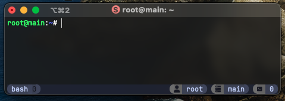
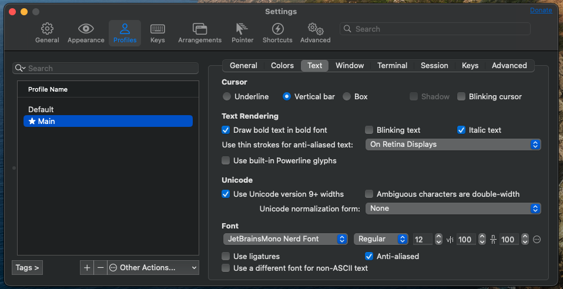

# tmux-config
This repo can be used to change the default tmux theme to an elegant monochrome catppuccin-based theme.



## Prerequisites
### Nerd fonts
A nerd font is needed for correctly displaying the status bar icons. This example uses [JetBrainsMono](https://github.com/ryanoasis/nerd-fonts/releases/download/v3.2.1/JetBrainsMono.zip).

## Installation
### Set the nerd font
Set the previously downloaded font as the main one in your favourite terminal. This example shows the settings for iTerm2.



### Apply configuration
Run the main installation script.
```
sh install.sh
```
For the changes to take effect, clear the tmux cache.
> ⚠️ **This will kill your running sessions.**
```
tmux kill-server
```
